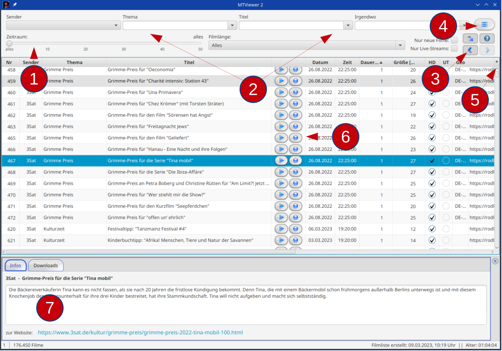
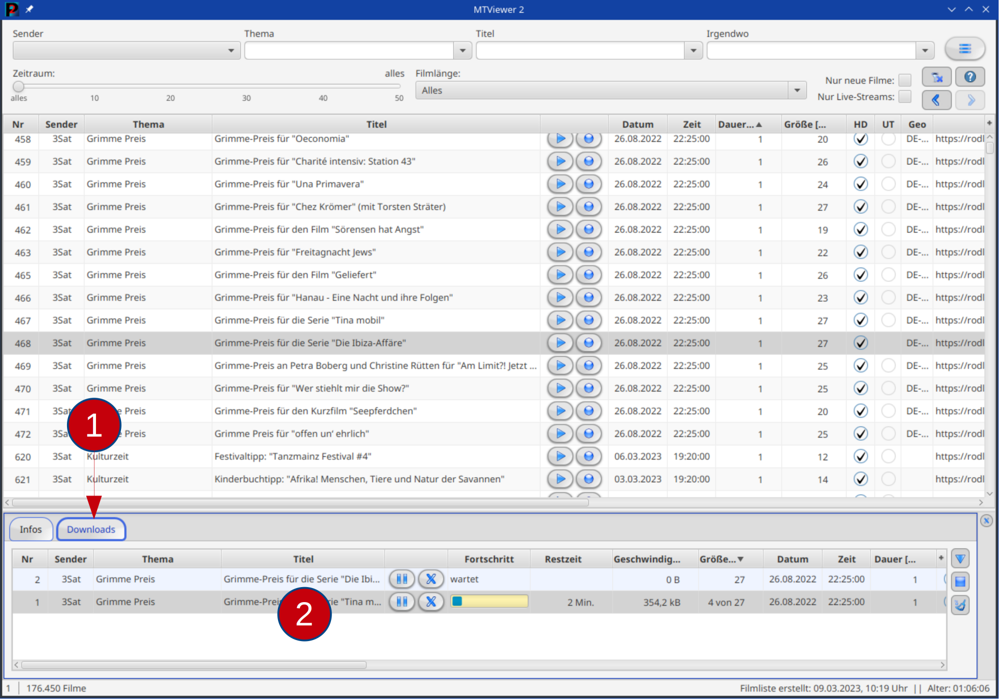

1. Die Filmliste kann hier zeitlich eingeschränkt werden.
2. Das sind Filter, die das Suchen in der Filmliste ermöglichen.
3. Hier können alte Filereinstellungen wiederhergestellt und der Filter gelöscht werden.
4. Das ist das Programm-Menü mit den Einstellungen und Infos über das Programm.
5. Hier (*+*) können Tabellenspalten ein- und ausgeblendet werden.
6. Ein Film oder ein Download kann hier gestartet werden.
7. Infos zum markierten Film werden hier angezeigt.

 

1. Hier werden die Downloads angezeigt.
2. Das ist die Liste aller angelegter Downloads.

### Ansicht Filmliste

Hier (Bild oben) wird die ganze (oder gefilterte) Filmliste angezeigt. Mit den Button in der Tabelle kann ein Film zum
Ansehen (Dreieck) oder Speichern (Kreis) gestartet werden. Weitere Möglichkeiten sind im Menü oder durch rechten
Mausklick möglich. Ein Doppelklick auf eine Tabellenzeile öffnet den Infodialog des Films.

Mit den Filtern über der Tabelle kann in der Filmliste gesucht werden. Ein Doppelklick in einen Textfilter löscht den
jeweiligen Filter. Die Button "<", ">" unter den Filtern stellen vorherige Filtereinstellungen wieder her. Der Button "
X" löscht alle Filter.

Die Farben der Tabellenzeilen haben diese Bedeutung:

Orange Schrift markiert geogeblockte Sendungen und diese können nur aus dem
angegebenen Land heruntergeladen oder abgespielt werden.  
Blaue Schrift markiert Filme die neu in der Filmliste sind.  
Rote Schrift kennzeichnet Livestreams.

 

### Ansicht Downloads

Hier werden alle Downloads angezeigt. In der Tabelle können Downloads gestartet und gelöscht werden. Im Kontextmenü gibt
es viele weitere Möglichkeiten, Downloads zu steuern. Auch kann dort die Bandbreite pro Download vorgegeben werden.

Ein Doppelklick auf eine Tabellenzeile öffnet den Bearbeitungsdialog des Downloads (solange er noch nicht gestart ist,
können dort Zielpfad und -dateiname und die Auflösung geändert werden).

Die Button rechts neben der Tabelle starten alle Download (Dreieck), stoppen alle Downloads (Quadrat) oder räumen die
Tabelle auf (Besen), es werden alle abgeschlossen Downloads entfernt.

Die Farben der Tabellenzeilen haben diese Bedeutung:

Graue Einträge warten auf den Download  
Orange markierte Einträge werden aktuell geladen, es wird die Downloadbandbreite und
die voraussichtliche Restzeit angezeigt  
Grüne Downloads sind erfolgreich abgeschlossen  
Rot markiert fehlerhafte Downloads

 
