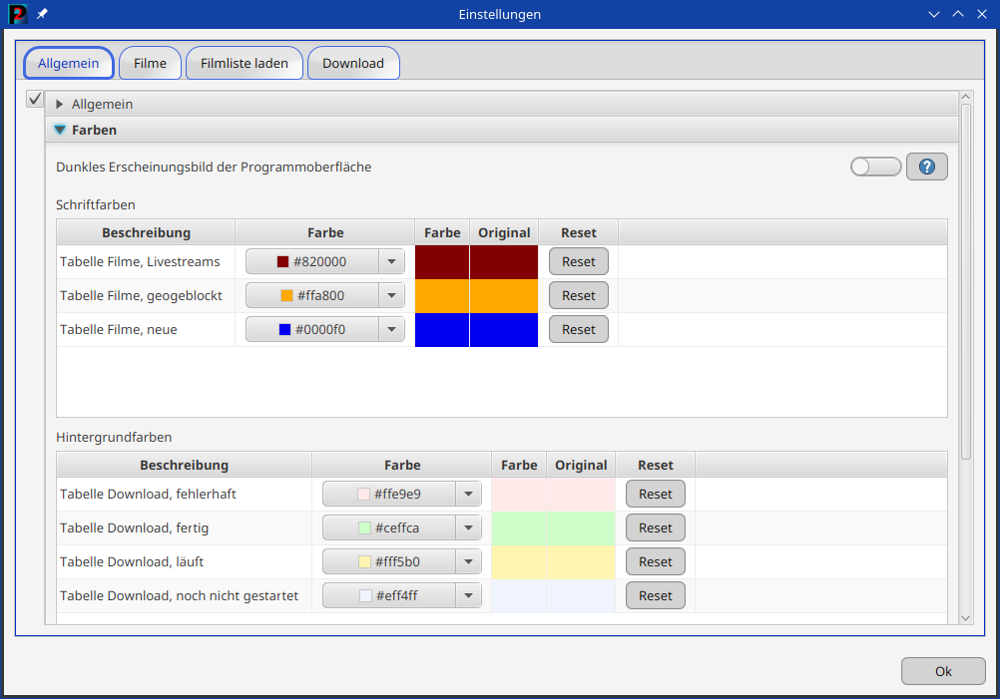
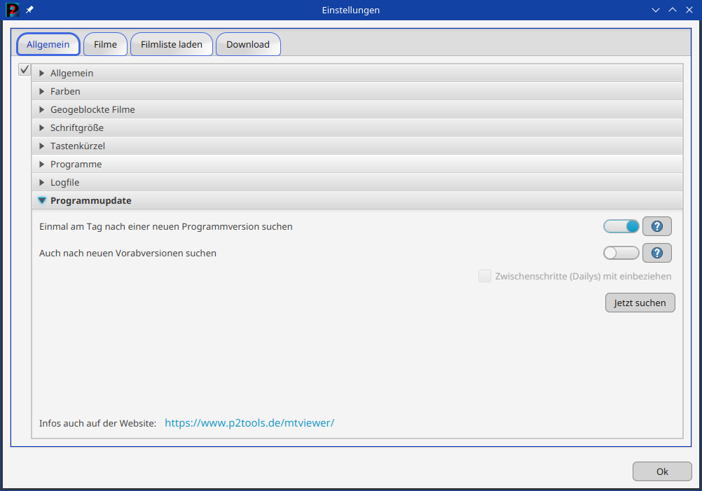

 

Über das Menü ist der Dialog Einstellungen zu erreichen. Hier (wie beispielhaft oben zu sehen) lassen sich die
verwendeten Farben im Programm ändern oder es lässt sich eine automatische Suche nach einem Programmupdate beim
Programmstart einschalten.

Weitere Einstellmöglichkeiten sind:

- Zeilenhöhe in der Tabelle Filme und Downloads
- Anlegen einer Logdatei
- Ändern der verwendeten Farben in den Tabellen der Filme und Downloads
- Markieren geogeblockter Filme
- Auswahl von Programmen: Dateimanager, Videoplayer, Webbrowser
- Suche und Anzeige eines Programmupdates
- Die Schriftgröße im Programm kann angepasst werden
- Wann und wie die Filmliste geladen werden soll
- Ob Filme (kurze Filme, alte Filme) oder Sender aus der Filmliste bereits beim Laden derselben, aussortiert werden
  sollen
- Einstellmöglichkeiten zum Download und zum Ersetzen verschiedener Zeichen im Zieldateinamen

Wichtig ist, dass bei allen Einstellmöglichkeiten ein "Hilfebutton" vorhanden ist, der eine Erklärung zu den
Möglichkeiten anbietet.

